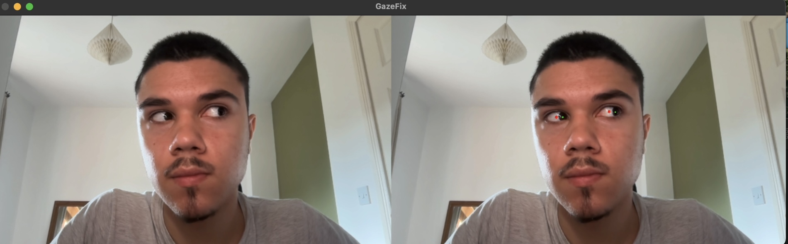
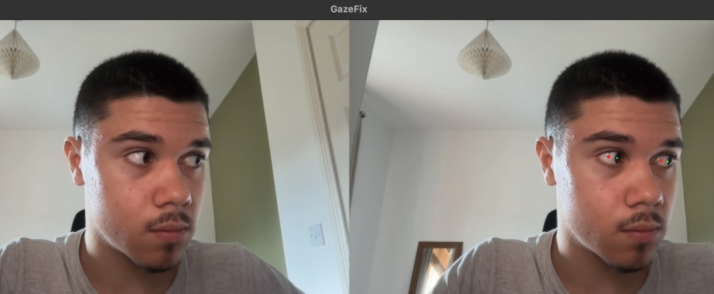
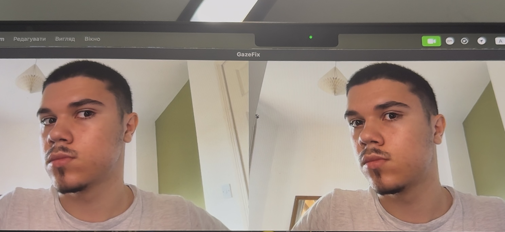
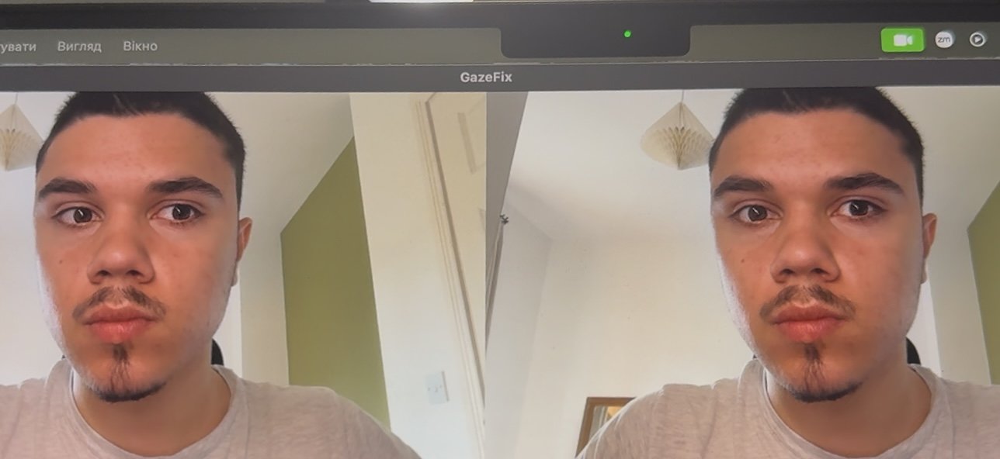

# GazeFix
GazeFix is a real-time gaze correction prototype built with **MediaPipe, OpenCV, NumPy, and scikit-learn**. It detects facial and iris landmarks, estimates head pose, predicts the target iris position using a small Linear Regression model, and locally shifts the eye region to improve eye contact with the webcam.

# Project Note
GazeFix is a prototype created to explore how a real-time gaze correction system can be designed and implemented using Computer Vision and Machine Learning. The project demonstrates an end-to-end development process, including the use of pretrained models, facial and iris landmark detection, head-pose estimation, calibration, Machine Learning regression, real-time image processing, and local eye-region warping. The main goal of GazeFix is to show how these different techniques can be combined into one working system and to demonstrate the practical skills gained while building it.

# Where can be useful
GazeFix can be useful in:
- video calls and online meetings
- remote interviews
- online classes and presentations
- livestreams
- recorded videos and tutorials

# How It Works
1. The webcam captures the user's face in real time.
2. A pretrained **MediaPipe Face Landmarker** detects facial and iris landmarks.
3. GazeFix calculates the current iris positions and estimates the user's head pose.
4. During calibration, a **Linear Regression** model learns where the irises should be when the user is looking directly at the camera.
5. During normal use, the model predicts the target iris positions for the current head pose.
6. OpenCV calculates the required iris movement and applies a local image warp using `cv2.remap()`.
7. The corrected frame is displayed next to the original webcam frame.

# How to Use
1. Look directly at the webcam
2. Press `C` to start calibration and slowly move your head while keeping your eyes focused on the camera
3. Press `S` to stop calibration and train the Linear Regression model
4. Press `G` to enable gaze correction
5. Press `T` to disable gaze correction
6. Press `ESC` to close the application

# Demo
## The image below shows how GazeFix compares the **current iris position** with the **predicted target position**.
- **Green point** - detected current iris center
- **Red point** - predicted iris position when looking toward the webcam
The distance between these two points is used to calculate the correction vector that determines how far and in which direction the iris region should be shifted.

## The image below shows GazeFix during normal use with gaze correction enabled.
The **original frame** shows the user's natural gaze, while the **corrected frame** shows the result after the predicted iris movement and local eye-region warping are applied.
This demonstrates the final output of the current GazeFix pipeline without any debug markers.

